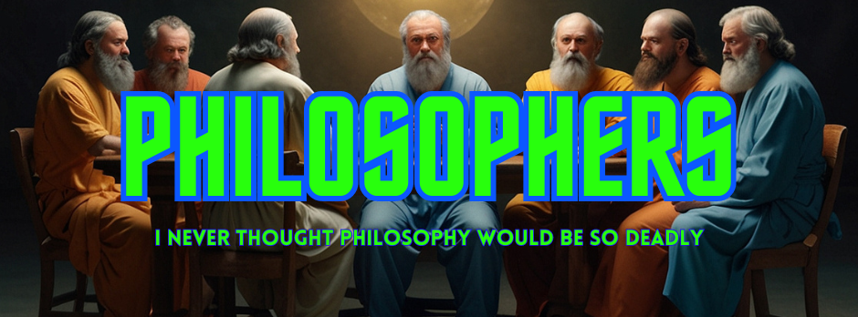
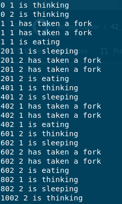
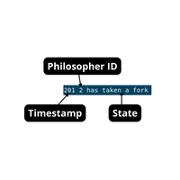

# 42_Philosophers


In this project, we have learn the basics of threading a process.
We also saw how to create threads and how to use mutexes.

## Table of Contents

- [Introduction](#introduction)
- [First things first](#first-things-first)
- [Usage](#usage)
- [Explanation](#explanation)
- [Makefile Overview](#makefile-overview)
- [License](#license)

## Introduction
This project is a big metaphor for sharing resources and synchronization. Every philosopher is a thread. Every fork is a mutex. Imagine that you have one or more philosophers who are sitting at a round table, and in the middle, there is a large bowl of spaghetti. The philosophers can alternately eat, think, or sleep. While they are eating, they are not thinking nor sleeping; while thinking, they are not eating nor sleeping; and, of course, while sleeping, they are not eating nor thinking. There are also forks on the table. There are as many forks as there are philosophers. Because serving and eating spaghetti with only one fork is very inconvenient, a philosopher takes their right and left forks to eat, one in each hand. When a philosopher has finished eating, they put their forks back on the table and start sleeping. Once awake, they start thinking again. The simulation stops when a philosopher dies of starvation.

To understand better what are the requirements of this project, see the [subject.](subject/en.subject.pdf)
> This project's code was written according to the [42 norm guidelines(norminette)](norm/en.norm.pdf).

## First things first
First of all, I would like to thank the people who gave time and energy to construct incredible articles and videos about the dinning philosophers problem and C programming in general. Thank you very much!
Here are some of the sources that I used to understand the concepts behind everything in this project:


- [Youtube playlist](https://www.youtube.com/watch?v=d9s_d28yJq0&list=PLfqABt5AS4FmuQf70psXrsMLEDQXNkLq2) By [Code Vault.](https://www.youtube.com/@CodeVault)
- [CodeQuoi](https://www.codequoi.com/en/author/mcombeau/) By [Mia Combeau](https://medium.com/@mcombeau)
- [The Dinning Philosophers Problem](https://www.youtube.com/watch?v=UGQsvVKwe90&t=1119s&pp=ygUbZGluaW5nIHBoaWxvc29waGVycyBwcm9ibGVt) By [Jamshidbek Ergashev](https://www.youtube.com/@jamshidbekergashev6746)


Thank you very much for the contribution to the community!

## Usage

To use the philophers project, follow these steps:
1. Clone the repository
```bash
git clone git@github.com:amauricoder/42_Philosophers.git
```

2. Do make to compile the files
```bash
make
```
This will generate the philo file in the root folder, that is executable of the program.

## Arguments

The program accepts the following arguments:

./philo qt_of_philosophers time_to_die time_to_eat time_to_sleep qt_of_meals (optional)

Where:
- `./philo`: Name of the executable.
- `qt_of_philosophers`: Quantity of philosophers in the simulation.
- `time_to_die`: Time limit a philosopher can go without eating.
- `time_to_eat`: Time a philosopher spends eating.
- `time_to_sleep`: Time a philosopher spends sleeping.
- `qt_of_meals`: Minimum number of meals each philosopher needs to have before the simulation ends. This is an optional argument.

## Explanation

When you run the project, it will display logs on your terminal.



Where




There are below some tests for the simulation:

| Qt Philosophers | Time to die | Time to eat | Time to sleep | Quantity of meals | Result        |
|-----------------|-------------|---------------|-------------|---------------|---------------|
| 2               | 410         | 200           | 200         |         |   No philo dies |
| 2               | 410         | 200           | 200         |    3    |   No philo dies and the simulation stops after 3 eats each |
| 3               | 610         | 200           | 200         |        |   No philo dies |
| 2               | 400         | 200           | 200         |         |   A philo dies |
| 4               | 200         | 210           | 200         |         |   A philo dies |

## Makefile Overview

In this project, the Makefile offers the following essential rules:

- **make**: Compiles the main project to `philo` executable.

- **make clean**: Cleans the directory by removing `.o` files, preserving `philo` executable.

- **make fclean**: Completely cleans the directory by deleting both `.o` files and `philo` executable.

- **make re**: Refreshes `philo` by recompiling everything.

## License
[View License](LICENSE)

You are free to use this project as you want. 
However, I don't recommend copying it if you don't understand the concepts involved and are unable to reconstruct it from scratch. Good luck!
